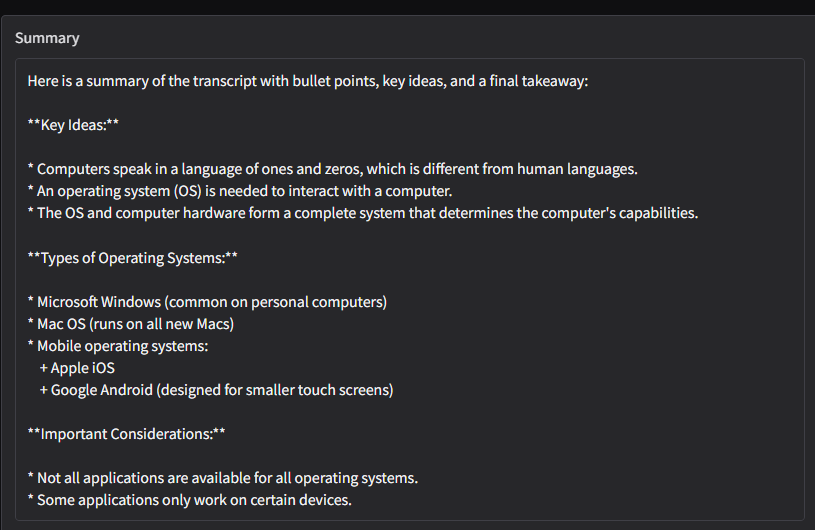
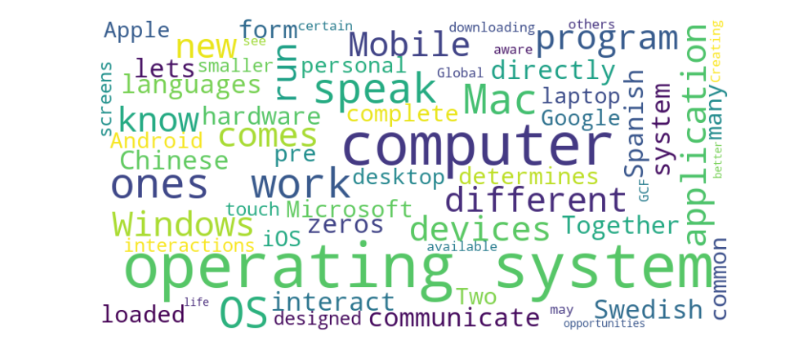

# AI YouTube Video Summarizer

An AI-powered application that downloads audio from YouTube videos, converts speech into text using Whisper, generates concise summaries using LLaMA-3 via Groq, and visualizes important keywords through a word cloud.

---

## Features

* Download audio directly from YouTube videos
* Convert speech to text using OpenAI Whisper
* Generate AI summaries using LLaMA-3
* Create word cloud visualizations from transcripts
* Interactive web interface built with Gradio
* Automatic temporary audio cleanup

---

## Tech Stack

* Python
* Gradio
* OpenAI Whisper
* Groq API
* LLaMA-3
* yt-dlp
* Matplotlib
* WordCloud

---

## Project Workflow

```text
YouTube URL
   ↓
Audio Download (yt-dlp)
   ↓
Speech-to-Text (Whisper)
   ↓
AI Summarization (LLaMA-3 via Groq)
   ↓
Word Cloud Generation
   ↓
Gradio Web Interface
```

---

## Installation

### 1. Clone the Repository

```bash
git clone https://github.com/alextbuilds/ai-youtube-summarizer.git
cd ai-youtube-summarizer
```

---

### 2. Create a Virtual Environment (Optional but Recommended)

```bash
python -m venv venv
```

Activate the environment:

#### Windows

```bash
venv\Scripts\activate
```

#### Linux / macOS

```bash
source venv/bin/activate
```

---

### 3. Install Dependencies

```bash
pip install -r requirements.txt
```

---

### 4. Install FFmpeg

This project requires FFmpeg for audio extraction.

Download FFmpeg from:

https://ffmpeg.org/download.html

Make sure FFmpeg is added to your system PATH.

---

### 5. Configure Environment Variables

Create a `.env` file in the project root directory:

```env
GROQ_API_KEY=your_api_key_here
```

Get your API key from:

https://console.groq.com/keys

---

## Run the Application

```bash
python app.py
```

The Gradio interface will open in your browser.

---

## Troubleshooting

### YouTube Bot Verification Error

Sometimes YouTube may temporarily block requests with an error similar to:

```text
Sign in to confirm you’re not a bot
```

This usually happens due to YouTube rate limiting or bot detection.

Possible fixes:

* Retry the request after a few seconds
* Update `yt-dlp` to the latest version
* Use browser cookies with `yt-dlp` if the issue persists

Update yt-dlp:

```bash
pip install -U yt-dlp
```

For cookie-based authentication, refer to:
https://github.com/yt-dlp/yt-dlp/wiki/FAQ


## Example Output

* AI-generated summary of a YouTube video



* Word cloud visualization of important terms



---
## Future Improvements

* Support for multilingual transcription    
* Better prompt engineering
* Download transcript as PDF
* Topic extraction
* Dark mode UI
* Timestamp-based summarization

---

## Learning Outcomes

This project helped explore:

* AI application pipelines
* Speech recognition
* LLM-based summarization
* API integration
* Interactive ML interfaces
* Data visualization

---

## Disclaimer

This project is intended for educational and learning purposes only.

---

## Author

Built by Alextbinobuilds
